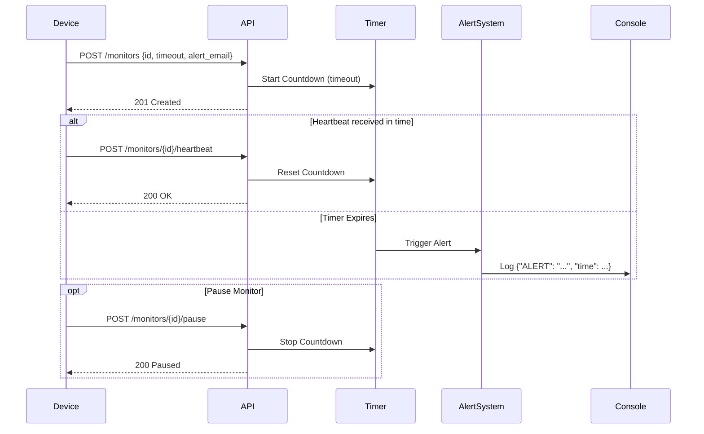

## Architecture

The system uses an in-memory Node.js state store to track registered devices and their countdown timers.



## Setup Instructions

1. **Prerequisites:** Make sure you have Node.js installed.
2. **Install Dependencies:**
   ```bash
   npm install
   ```
3. **Run the Server:**
   ```bash
   node server.js
   ```


## API Documentation

### 1. Register a Monitor
Create a new monitor and start the countdown timer.

**Request:** `POST /monitors`
**Body:**
```json
{
  "id": "device-123",
  "timeout": 60,
  "alert_email": "admin@critmon.com"
}
```

**Response (201 Created):**
```json
{
  "message": "Monitor device-123 created with 60s timeout."
}
```

### 2. Heartbeat (Reset)
Send a signal to the server to reset the countdown timer, preventing the alert from firing.

**Request:** `POST /monitors/{id}/heartbeat`

**Response (200 OK):**
```json
{
  "message": "Heartbeat received, timer reset."
}
```

### 3. Pause (Snooze)
Pause monitoring while repairing a device to prevent false alarms. The timer stops completely. To resume, simply call the heartbeat endpoint.

**Request:** `POST /monitors/{id}/pause`

**Response (200 OK):**
```json
{
  "message": "Monitor device-123 is paused."
}
```

### 4. The Developer's Choice: Get All Monitors
*Feature Added:* Global Observatory Endpoints

**Request:** `GET /monitors`

**Explanation:** 
A robust monitoring system should not be a "black box" that only speaks when things fail. Support engineers will want to view the current list of monitors, their configured timeouts, and their real-time status (`active`, `paused`, `down`) to feed into a dashboard. This added endpoint enables a UI or dashboard to dynamically list all registered devices and their current states without waiting for failure alerts.

**Response (200 OK):**
```json
[
  {
    "id": "device-123",
    "timeout": 60,
    "alert_email": "admin@critmon.com",
    "status": "active",
    "lastHeartbeat": "2026-06-22T10:00:00.000Z"
  }
]
```
There is also an endpoint to get a specific monitor:
**Request:** `GET /monitors/{id}` ...

